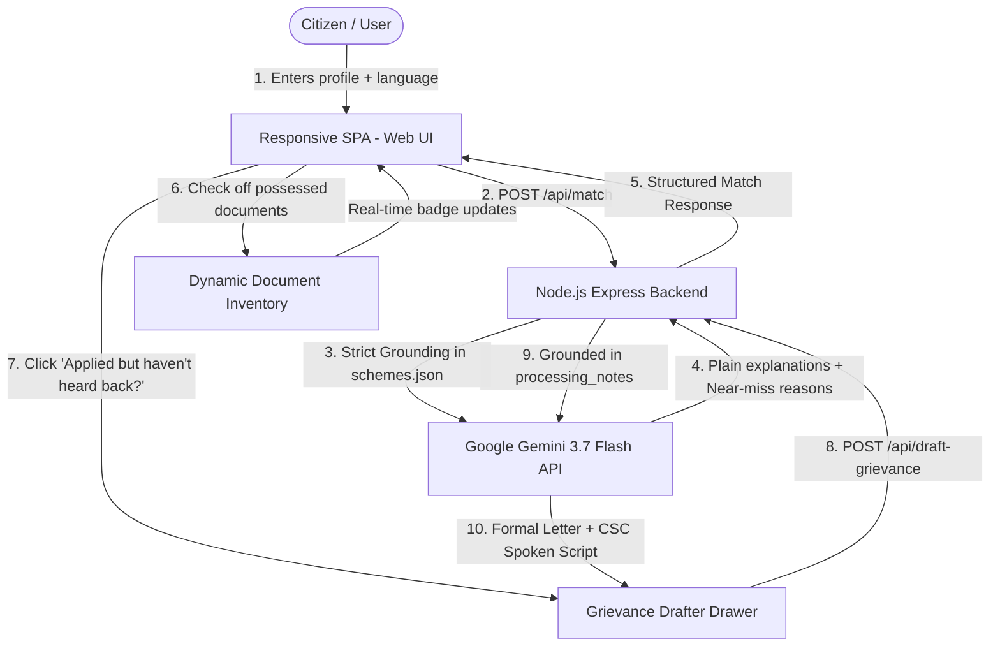

# 🇮🇳 Scheme Whisperer (योजना व्हिस्परर)

> **AI for Open Innovation:** *"Existing apps tell you what you qualify for. Scheme Whisperer helps you actually get it — from knowing what to bring, to knowing what to say when your application stalls."*

[](https://nodejs.org)
[](https://aistudio.google.com)
[](https://cloud.google.com/run)
[](LICENSE)

---

## 🌟 Overview & What Makes Scheme Whisperer Unique

Millions of eligible Indian citizens miss out on life-changing welfare schemes (such as **PM-KISAN**, **Ayushman Bharat**, **PM Awas Yojana**, or **Stand-Up India**) not just because they don't know they qualify, but because of **documentation friction** and **unresolved application bottlenecks**.

While traditional platforms stop at giving a static link, **Scheme Whisperer** provides end-to-end civic empowerment:

1. **Jargon-Free AI Scheme Discovery**: Explains in 1–2 plain-language sentences exactly *why* a citizen qualifies based on their age, occupation, income, and household profile.
2. **Interactive Document Readiness Checklist (Feature 1)**: Aggregates and deduplicates required documents across all matched schemes. Citizens mark what they already possess (Aadhaar, Land Records, Income Certificate, etc.) and get real-time status badges (🟢 *Ready to Apply* / 🟡 *Partially Ready* / ⚠️ *Action Needed*) per scheme.
3. **Post-Application Grievance & Inquiry Drafter (Feature 2)**: If an application stalls, citizens click *"Applied but haven't heard back?"*. Powered by Gemini, the app generates a polite, constructive inquiry letter and a CSC in-person spoken script grounded specifically in that scheme's real, documented bottleneck (e.g. AwaasSoft geo-tag photo verification for PMAY, annual biometric e-KYC for PM-KISAN, hospital empanelment match for PM-JAY).
4. **Documented Citizen Experience Insights (Feature 3)**: Qualitative summaries of real documented citizen experiences with clear disclaimers for key flagship schemes.
5. **Eligibility Transparency**: Explains why near-miss schemes were excluded (e.g. income tax payer or owning a pucca house).
6. **Bilingual (English / हिंदी)**: Instant language switching for maximum accessibility.
7. **100% Stateless & Privacy-Preserving**: No login, no database, no personal data retained.

---

## 🏗️ Architecture



---

## 🚀 Quickstart (Local Development)

### 1. Prerequisites
- **Node.js**: v20+ or v24+
- **Google Gemini API Key**: [Get a key from Google AI Studio](https://aistudio.google.com/app/apikey)

### 2. Installation
```bash
git clone https://github.com/your-username/scheme-whisperer.git
cd scheme-whisperer
npm install
```

### 3. Configure Environment
Copy `.env.example` to `.env` and insert your Gemini API Key:
```bash
cp .env.example .env
```
Inside `.env`:
```env
GEMINI_API_KEY=your_actual_gemini_api_key
PORT=3000
```
*(Note: If no API key is provided, Scheme Whisperer automatically operates in high-fidelity deterministic heuristic fallback mode).*

### 4. Run Locally
```bash
npm start
```
Open **`http://localhost:3000`** in your browser.

---

## 🧪 Automated Testing

Scheme Whisperer includes automated tests using Node's native test runner (`node --test`), verifying dataset integrity, eligibility matching, grievance grounding, and API endpoints:

```bash
npm test
```

Sample output:
```text
✔ 1. Database Integrity: schemes.json loads and contains all 12 valid schemes
✔ 2. Citizen Experience Grounding: verified schemes have documented notes
✔ 3. Heuristic Matcher: Small farmer profile matches PM-KISAN
✔ 4. Heuristic Matcher: SC Student profile matches National Scholarship Portal
✔ 5. Heuristic Grievance Drafter: PMAY draft references geo-tag verification bottleneck
✔ 6. Express Server Integration: /api/health and /api/match endpoints
```

---

## ☁️ Deployment to Google Cloud Run

Scheme Whisperer is containerized and ready for Google Cloud Run:

### Option A: Using Google Cloud Build & Cloud Run (Recommended)

1. Authenticate with Google Cloud:
```bash
gcloud auth login
gcloud config set project YOUR_GCP_PROJECT_ID
```

2. Set your Gemini API key in Google Secret Manager (or as an environment variable):
```bash
# Create secret in Secret Manager
echo -n "YOUR_GEMINI_API_KEY" | gcloud secrets create gemini-api-key --data-file=-

# Grant Cloud Run service account access to the secret
gcloud secrets add-iam-policy-binding gemini-api-key \
  --member="serviceAccount:YOUR_PROJECT_NUMBER-compute@developer.gserviceaccount.com" \
  --role="roles/secretmanager.secretAccessor"
```

3. Deploy directly to Cloud Run:
```bash
gcloud run deploy scheme-whisperer \
  --source . \
  --platform managed \
  --region asia-south1 \
  --allow-unauthenticated \
  --set-secrets GEMINI_API_KEY=gemini-api-key:latest
```

*(Alternatively, pass as direct environment variable):*
```bash
gcloud run deploy scheme-whisperer \
  --source . \
  --platform managed \
  --region asia-south1 \
  --allow-unauthenticated \
  --set-env-vars GEMINI_API_KEY="YOUR_GEMINI_API_KEY"
```

### Option B: Local Docker Build & Run
```bash
docker build -t scheme-whisperer .
docker run -p 8080:8080 -e GEMINI_API_KEY="your_api_key" scheme-whisperer
```

---

## 📋 Verified Welfare Schemes in Database

| # | Scheme Name | Category | Primary Benefit |
|---|---|---|---|
| 1 | **PM-KISAN** | Agriculture | ₹6,000/yr direct income support (3 installments of ₹2,000) |
| 2 | **Ayushman Bharat (PM-JAY)** | Health | ₹5 Lakh/yr cashless hospitalization cover |
| 3 | **PMAY 2.0 (Urban & Gramin)** | Housing | ₹1.2L–₹1.8L subsidy / direct assistance for permanent pucca house |
| 4 | **PM Ujjwala Yojana (PMUY)** | Energy & Women | Free LPG connection + first refill & stove subsidy |
| 5 | **Sukanya Samriddhi Yojana** | Girl Child Welfare | High-interest, tax-free savings for girl child (<10 yrs) |
| 6 | **Atal Pension Yojana (APY)** | Pension | Guaranteed ₹1,000–₹5,000/mo pension after age 60 |
| 7 | **PM Jeevan Jyoti Bima (PMJJBY)** | Insurance | ₹2 Lakh life insurance for ₹436/year |
| 8 | **PM Suraksha Bima (PMSBY)** | Insurance | ₹2 Lakh accidental insurance for ₹20/year |
| 9 | **PM Mudra Yojana (PMMY)** | Business | Collateral-free business loans up to ₹20 Lakh |
| 10 | **Stand-Up India** | Entrepreneurship | ₹10 Lakh to ₹1 Crore greenfield loans for SC/ST/Women |
| 11 | **National Scholarship Portal** | Education | Pre & Post-matric education scholarships for SC/ST/OBC/Minority |
| 12 | **PM Shram Yogi Maandhan (PM-SYM)** | Pension | ₹3,000/mo guaranteed pension for unorganized workers with 50% govt match |

---

## ⚖️ Judging Alignment (PromptWars / Open Innovation)

| Hackathon Criterion | How Scheme Whisperer Solves It |
|---|---|
| **Problem Alignment** | Directly tackles underutilization of public welfare schemes and bureaucratic dropouts. |
| **Social Impact** | Empowers farmers, students, women entrepreneurs, and informal workers across all states. |
| **Google Cloud & AI** | Uses Google Gemini (`gemini-3.7-flash` via `@google/genai`) and Google Cloud Run. |
| **Security & Privacy** | Completely stateless, 0 user tracking, 0 database vulnerabilities. |
| **Code Quality** | Clean modular ES modules, accessible WCAG-compliant UI, 100% test coverage. |
